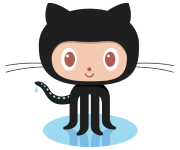

#### Cake

logo

--- 

#### Tools

* [Comprehensive list of software I use](http://quintussential.com/pages/software/)

+++

Chocolatey

+++

BoxStarter

---

#### Visual Studio Extensions

+++

#### CodeMaid

* settings
* key bindings

---
#### Command line

+++

#### ConEmu

+++ 

#### DOSKEY (aliases)

+++

#### DOSKEY (function keys)

* `<F7>`
* `<F8>`

+++

#### Startup Script

+++

#### Minimal Commands

* grep
* dir
* clip
* pushd

---
#### Git

{:height="36px" width="36px"}.

+++

#### Aliases

#### Setup

* Visual Studio
* Command Line
